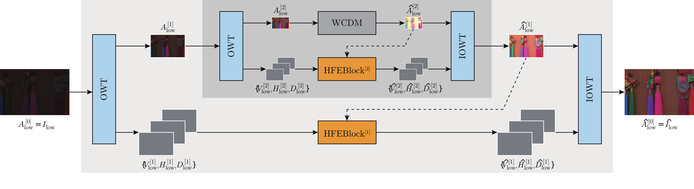
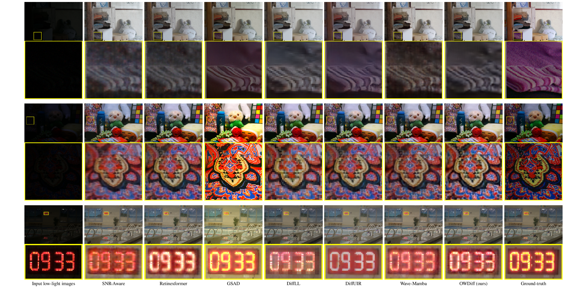
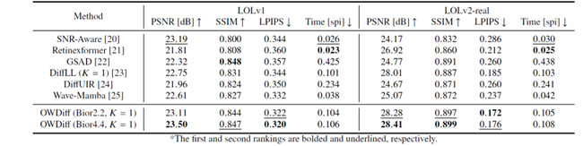

## Overlapped Wavelet Diffusion for Low-Light Image Enhancement

<p align="center">
  <b>Fen Peng</b><sup>1</sup>, Taizo Suzuki<sup>2</sup>, and Seisuke Kyochi<sup>3</sup>
  <br>
  <i>(Accepted by IEICE Trans. Inf. & Syst., Jan. 2027.)</i>
  <br>
  <a href="https://arxiv.org/"></a>
  <a href="#"></a>
</p>

---

## Pipeline



>**Summary:** In this study, we propose an overlapped wavelet diffusion framework for Low-Light Image Enhancement (LLIE), which incorporates two complementary components to achieve blocking artifact-free and detail-preserving enhancement. Although recent diffusion-based LLIE methods have demonstrated remarkable performance compared with traditional approaches, DiffLL still suffers from blocking artifacts caused by the Haar Wavelet Transform (WT) and blurred edges or over-smoothed textures due to the limitations of its High-Frequency Restoration Module (HFRM). To overcome these issues, we introduce an \textit{Overlapped} WT (OWT) that incorporates correlations across neighboring regions, thereby structurally preventing blocking artifacts. Furthermore, we integrate a low-frequency-guided High-Frequency Enhance Block (HFEBlock) to strengthen detail recovery, yielding sharper edges and more reliable textures. Extensive experiments on the LOLv1 and LOLv2-real datasets demonstrate that our framework, termed ``OWDiff,'' consistently outperforms existing LLIE methods both qualitatively and quantitatively, achieving superior visual quality while maintaining computational efficiency. OWDiff effectively addresses the structural limitations of the Haar WT and the HFRM, achieving an average PSNR gain of  0.58 dB, along with a 1.64% relative improvement in SSIM and a 5.9% relative reduction in LPIPS, compared to DiffLL across both the LOLv1 and LOLv2-real datasets.

## Evaluations

### Qualitative Comparison


### Quantitative Comparison


## Dependencies

```bash
pip install -r requirements.txt
```


## Datasets Download

* **LOLv1:** C. Wei, J. W. Wang, H. W. Yang, and Y. J. Liu. "Deep Retinex Decomposition for Low-Light Enhancement", arXiv preprint arXiv:1808.04560, 2018. [[Google Drive](https://drive.google.com/file/d/18bs_mAREhLipaM2qvhxs7u7ff2VSHet2/view)]
* **LOLv2:** H. W. Yang, J. W. Wang, F. H. Huang, Q. S. Wang, and Y. J. Liu. "Sparse Gradient Regularized Deep Retinex Network for Robust Low-Light Image Enhancement", IEEE Trans. Image Process, 2021. [[Google Drive](https://drive.google.com/file/d/1dzuLCk9_gE2bFF222n3-7GVUlSVHpMYC/view)]

## Pretrained Models

Coming soon.

## Train the model

Coming soon.

## Test the model

Coming soon.

## Citation

If you find our work useful in your research, please consider citing our paper:

```bibtex
@article{Peng2026OWDiff,
  title={Overlapped Wavelet Diffusion for Low-Light Image Enhancement},
  author={Fen, Peng and Taizo, Suzuki and Seisuke, Kyochi},
  journal={arXiv preprint arXiv:[XXXX.XXXXX]},
  year={2026}
}
```

## Acknowledgement

We would like to express our sincere gratitude to the developers of [DiffLL](https://github.com/JianghaiSCU/Diffusion-Low-Light) and [Wave-Mamba](https://github.com/AlexZou14/Wave-Mamba).

> Our implementation is inspired by and partially adapted from their wonderful repositories, which greatly facilitated this research.
